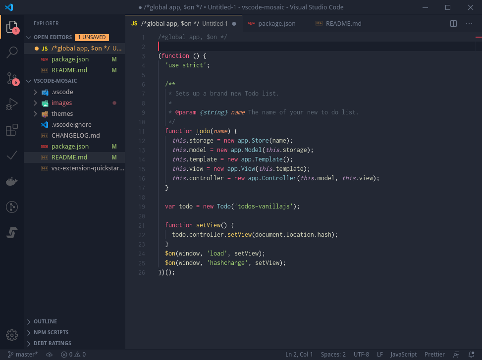
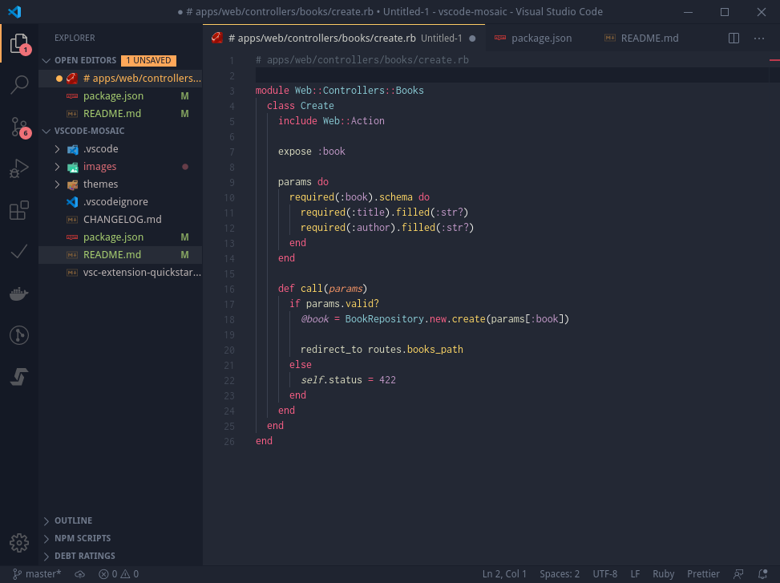
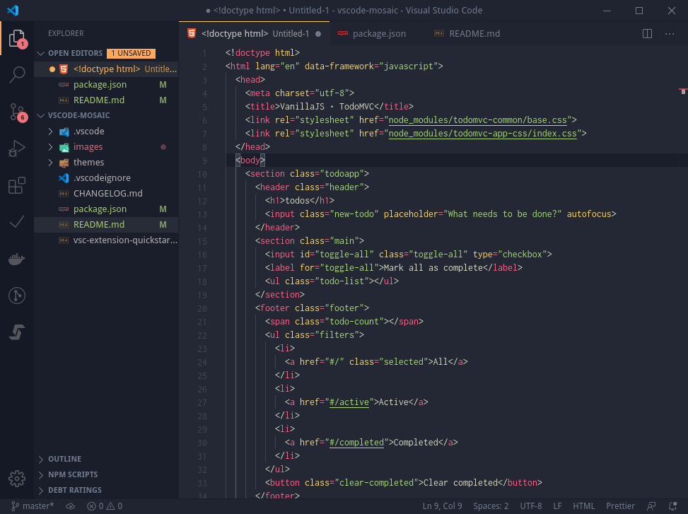
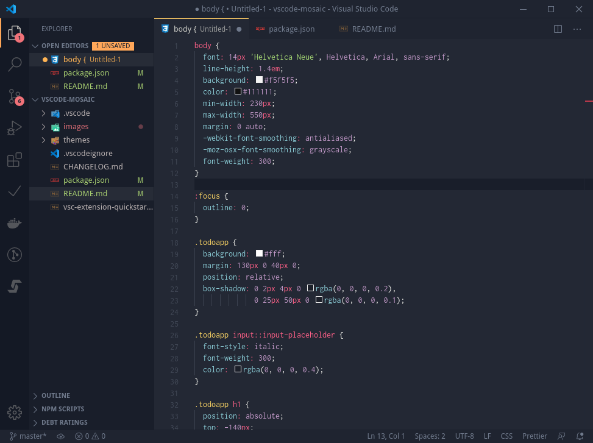

# Mosaic Theme

Yet another VSCode dark theme based on [Dracula](https://marketplace.visualstudio.com/items?itemName=dracula-theme.theme-dracula) tokens structure and [Mayukai Mono](https://marketplace.visualstudio.com/items?itemName=GulajavaMinistudio.mayukaithemevsc) beautiful colors.

**Disclaimer:** No intention to keep this up to date with the mentioned themes.

## Credits

[hop flower](https://thenounproject.com/term/hop/2721860/) icon by Tyler Gobberdiel from the [Noun Project](https://thenounproject.com).